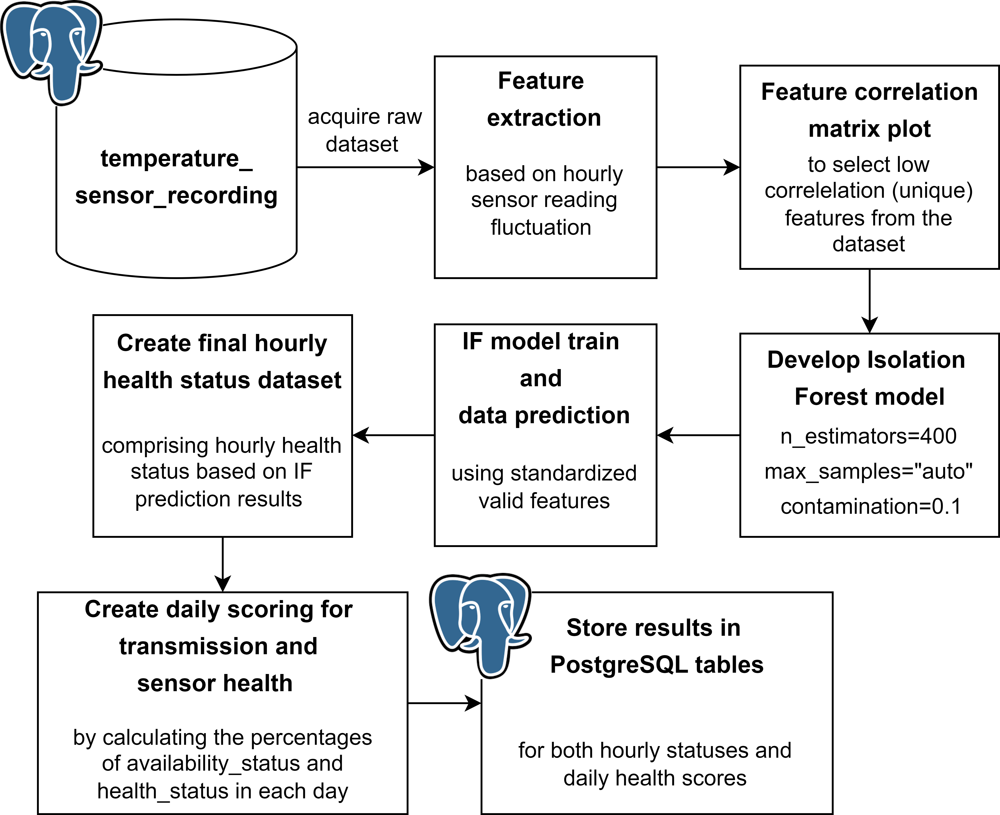

# Unsupervised-learning-based-temperature-sensor-health-assessment
An Isolation Forest outlier detection implementation for temperature sensor and transmission health scoring 


## 🔍 Overview



The system operates by:

1. **Connecting to a local PostgreSQL database table** to retrieve raw temperature sensor recording.
2. **Feature extraction** based on how the temperature data fluctuates every processed hour:
   - num_data: the number of raw temperature data recorded each hour
   - sampling_rate: the number of raw temperature data recorded each hour
   - range: recorded temperature range (=max temp-min temp) in each hour
   - standard_deviation: std of temperature recorded data in each hour
   - covar: coefficient of variation (=standard_deviation/mean) in each hour
   - max_rate: maximum absolute temperature change (celsius/minute) in each hour
   - min_rate: minimum absolute temperature change (celsius/minute) in each hour
   - rate_range: max_rate-min_rate
   - osc-freq: the number of temperature change direction (/minute) in each hour
   - var_score: the percentage of temperature change that exceeds the threshold (=0.031 celsius/minute) in each hour
   - hour_index: the index of hour in start_time (UTC+7) that may inform about the solar irradiance or lighting effects on the ambient temperature recorded

   non feature variables:
   - start_time: datetime (hour) object that shows the starting hour of each recorded temperature data time-window
   - availability_status: flag variable that shows whether there are at least 3 recorded temperature data in each hour; if the availability_status = 0 (there are less than 3 recorded temperature data in an hour), then the extracted features for that hour are considered invalid and filled with 0s except for the hour_index

3. **Feature correlation matrix plot** using Pearson's correlation coefficient method to look for unique pairs (lowly correlated features).
4. **Develop Isolation Forest Model** with 400 ensemble estimators, automatic maximum sample selection, and outlier percentage of 0.1 (the model predicts 10 percent of outliers from the whole prediction set).
5. **Train model and predict the train dataset** Since the IF is an unsupervised model, there is no dataset splitting for train and test, (i.e. the standardized train dataset is also used as test dataset). The anomaly score for each test sample is normalized and saved as "anomaly_scores", while the prediction labels (1: "Majority class", -1: "Outlier") are saved as "pred_labels". These variables are the associated with the complete hourly dataset that comprises both availability statuses. For rows with availability_status==0, the health_status column is filled with 1 (assuming the anomaly only adresses the transmission system, not the sensor health status), while the anomaly_score is set to 0 (marking invalid hourly temperature sensor diagnosis). Conversely, for rows with availability_status==0, the health_status column is filled with 1 ("Normal") if the pred label == 1, and 0 ("Abnormal") if the pred label is -1. 
6. Create a daily scoring table for transmission health status (transmission_hs) and temperature sensor health status (sensor_hs) based on the percentage of availability _status and health_status in a day respectively.
7. store the results as PostgreSQL database: 

hourly diagnosis table (df_hourly) ==> 'tempsensor_hourly_healthstatus'

daily diagnosis table (df_daily) ==> 'tempsensor_daily_healthscore'
   


## 📦 Files in This Repo

| File                                                   | Description                                     |
|--------------------------------------------------------|-------------------------------------------------|
| `Temperature Sensor Health Assesment_Postgres.ipynb`   | Main script to run the health assesment         |
| `requirements.txt`                                     | Python package dependencies                     |
| `README.md`                                            | This documentation                              |
| `flowchart.png`                                        | Flowchart image of this project                 |

> **Note:** actual raw dataset file is not included due to data-sharing restrictions.  
> You must provide your own dataset:  
> `temperature_sensor_recording`


## 📊 Database Tables

The system takes raw temperature sensor from a PostgreSQL table (which you have to provide), and also stores the result into Postgres tables with the following table structures:

### temperature_sensor_recording

Storesthe recorded temperature sensor readings with the corresponding timestamps.

```sql
CREATE TABLE Equipments (
    time_received TIMESTAMP PRIMARY KEY,
    temp_1 REAl,
    temp_2 REAL,
);
```

**Example Data:**

| time_received          | temp_1    | temp_2     | 
|------------------------|-----------|------------|
|2024-01-01 11:35:27     | 27.34     | 32.34      | 
|2024-01-01 11:36:27     | 27.65     | 32.53      | 
|2024-01-01 11:37:27     | 27.89     | 32.76      | 
> **Note:** temp_1 and temp_2 may come from different sensors, but the python script demo in Temperature Sensor Health Assesment_Postgres.ipynb uses temp_1.  


### tempsensor_hourly_healthstatus Table

stores the hourly assesment/diagnosis of the recorded data quality.

```sql
CREATE TABLE Health_Status (
    start_time TIMESTAMP PRIMARY KEY,
    hour_index INTEGER,
    num_data REAL,
    sampling_rate REAL,
    availability_status REAL,
    .
    .
    .
    health_status INTEGER,
    anomaly_score REAL,
    date DATE
);
```

**Example Data:**

| start_time          | hour_index  | features  | health_status | Channel | HealthStatus | Diagnosis | Description           |
|---------------------|-------------|-----------|---------------|---------|--------------|-----------|-----------------------|
| 2024-01-01 11:00:00 | 18          | .....     | 0             | 0.34    | 1            | Normal    | Earthquake occurrence |
| 2024-01-01 12:00:00 | 19          | .....     | 1             | 0.89    | 1            | Normal    | Earthquake occurrence |
| 2024-01-01 13:00:00 | 20          | .....     | 1             | SHZ     | 1            | Normal    | Earthquake occurrence |


> Note: LM = "Locked Mass" seismometer fault type


### Daily_Report Table

Summarizes equipment health on a daily basis.

```sql
CREATE TABLE Daily_Report (
    TimeStamp TEXT PRIMARY KEY,
    DayIndex TEXT,
    StationID TEXT,
    EquipmentID TEXT,
    HealthScore FLOAT
);
```

**Example Data:**

| TimeStamp           | DayIndex   | StationID | EquipmentID | HealthScore |
|---------------------|------------|-----------|-------------|-------------|
| 2025-04-10T23:35:00 | 2025-04-10 | ABC       | 01          | 75.00       |
| 2025-04-10T23:35:06 | 2025-04-10 | GHI       | 03          | 50.00       |
| 2025-04-10T23:35:12 | 2025-04-10 | IJK       | 04          | 33.33       |


## 🚀 Usage

1. Ensure your PostgreSQL database is running and the `Health_Status` and `Daily_Report` tables are set up.  
2. Make sure your station XML inventory files are available in `/path/to/inventory/{StationID}.xml`.  
3. Run the diagnosis script:

```bash
python seismometer_diagnosis.py
```


